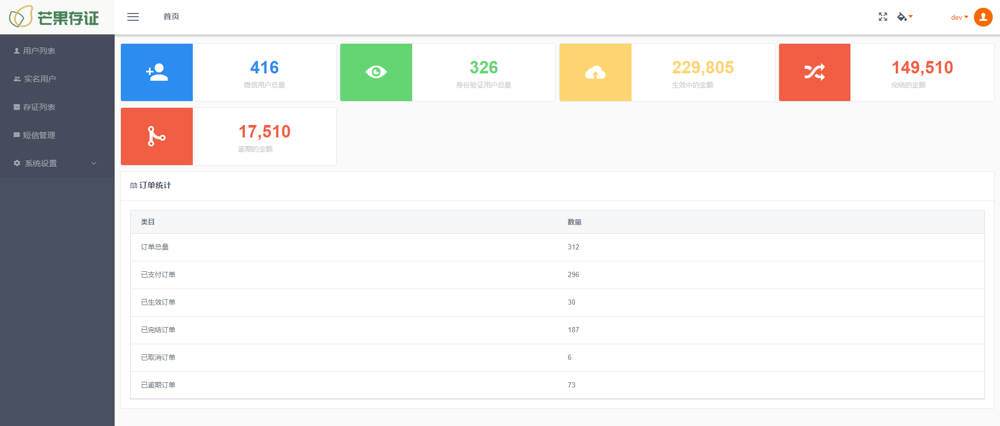
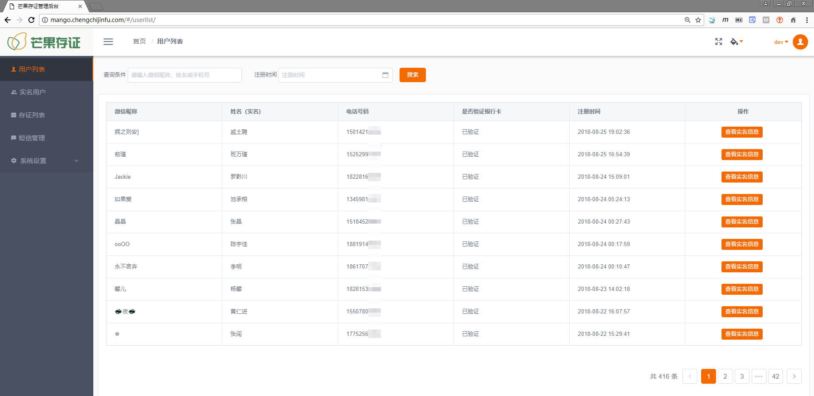
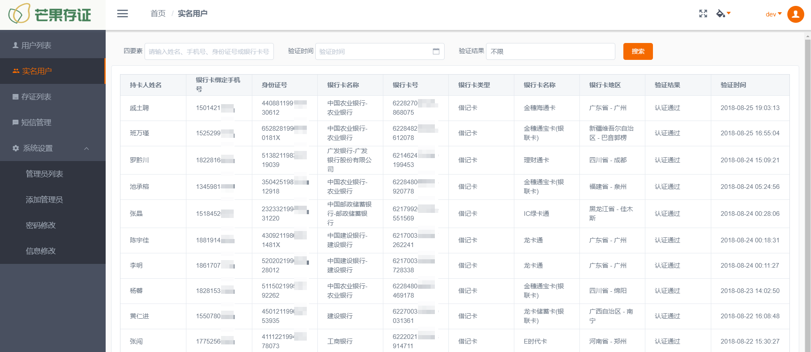
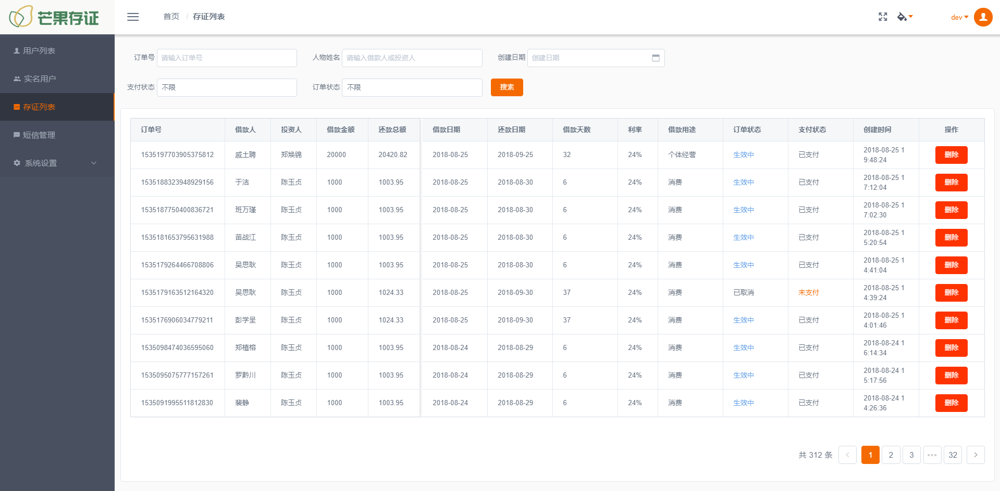

# 前言

　　各位 HR，面试官你们好，欢迎来到我的 Github。为了能更好的介绍自己的项目，特别创建本仓库介绍我的项目，顺便也是对自己过去的项目回顾和总结。

　　在这里我将描述项目背景、项目简介、技术栈、我的工作、难点、遇到的困难、优化。


# 项目目录

1. 在线存证平台
2. 信息化考勤
3. 影像管理系统
4. 宫颈细胞筛查分类
5. 学代会换届选举投票系统
6. 华东计算机基础研究会官网


# 项目说明

## 1. 在线存证平台

### 1.1 项目时间

2018/3 - 2018/5

### 1.2 项目简介

- 第三方电子证据综合服务平台，通过在线签署借款电子合同，保证签署双方的身份主体信息真实有效。借款人和投资人通过平台签署借款协议，使得借款流程有理有据，保证了双方的合法权益，减少双方的不必要纠纷。
- 实现小程序客户端、Web后台管理的在线借据存证平台

### 1.3 技术实现

- Java Web 框架：SpringBoot

- 数据库：MySQL 5.6 + Redis
- 服务器：Centos 7.3
- 移动端实现：微信小程序
- 系统后台管理：vue.js + bootstrap
- 文档技术：接口文档使用 apidoc，项目说明使用 kancloud 在线文档
- 代码托管：码云

### 1.4 我的工作

- 需求分析，前后台技术栈方案制定
- 数据库设计、定时备份、Redis缓存

- Java 后台 RESTful API 接口开发（实现 JWT 接口验证）
- HTTPS 证书配置、Nginx 代理
- Linux 正式、测试服务器搭建、Docker 容器配置
- 对接第三方接口平台（包括：微信支付、银行卡四要素验证、短信服务）
- 后台实现定时任务、短信消息队列
- 业务逻辑、流程图

### 1.5 项目难点

- 暂时还没想好

### 1.6 项目优化

- 待完善

### 1.7 项目代码

```powershell
PS D:\dev> .\cloc-1.76.exe .\mango_server\
     435 text files.
     310 unique files.
     235 files ignored.
github.com/AlDanial/cloc v 1.76  T=1.00 s (297.0 files/s, 31021.0 lines/s)
-------------------------------------------------------------------------------
Language                     files          blank        comment           code
-------------------------------------------------------------------------------
JavaScript                      66            370            790           6539
Java                            90           1620           2633           6331
XML                            120              0              0           5078
JSON                             5              3              0           4787
SQL                              1             20             57            787
HTML                             2             63              0            607
CSS                              4             98             37            492
Bourne Shell                     1             29             51            145
DOS Batch                        2             32              0            114
Maven                            1             36             53            110
Markdown                         3             16              0             64
YAML                             2              8              0             51
-------------------------------------------------------------------------------
SUM:                           297           2295           3621          25105
-------------------------------------------------------------------------------
```

### 1.8 项目展示

接口文档（使用 `apidoc` 工具编写）

- [RESTful API在线文档](https://api.chengchijinfu.com/mango/apidoc/index.html)


小程序移动端入口（二维码）

<div align="left"></div>


移动端截图

<div align="left"></div>


系统后台截图

<div align="left"></div>

<div align="left"></div>

<div align="left"></div>

<div align="left"></div>


## 2. 信息化考勤

2017.03-2017.07 

通过信息化系统实现了信息联通，打通数据孤岛，解决内部多平台、多站点、多数据库的现状。以移动微信企业号为移动终端，Web考勤在线为PC终端，实现企业社区、考勤管理、工单管理等等功能模块。【企业实践】

角色：需求分析、数据库设计、后台开发

RESTful API在线文档：http://user.renrunkeji.com/apidoc/

目前系统已经正在使用一年时间，地址：http://user.renrunkeji.com


## 3. 影像管理系统

2017.10-2017.12

以杭州锦江集团财务审批为背景，实现桌面应用端和Web端，扫描仪扫描图片，图片条形码识别，影像上传管理系统。文件系统基于OpenCMIS，并实现Web第三方RESTful Api接口。【个人项目】

基于OpenCMIS实现了Web端第三方API接口


## 4. 宫颈细胞筛查分类

2017.10-2017.12

医疗辅助诊断系统。对宫颈细胞显微镜下图片分割，特征提取。对宫颈鳞状单细胞，基于特征，应用机器学习算法进行分类。【实验室项目】


## 5. 学代会换届选举投票系统

2015-2017

同时在学生工作之余，也为学代会换届投票选举开发了在线实时投票系统，高效解决选票计票的繁琐问题。并实践了三年的版本迭代

地址：http://hise.frankfeekr.top/hise/admin 


## 6. 华东高校计算机基础教学研究会网站

2015.4

在校期间，刚接触web网站编程的那段时间，实现了一个新闻网站的全站点开发。主要应用的是ASP.NET进行开发的，回过头来看如今前后端分离的开发模式，现在已经完全都抛弃了这种开发方式。 

地址：http://cai.hznu.edu.cn/hdgx/


# 后记

xxx说明


