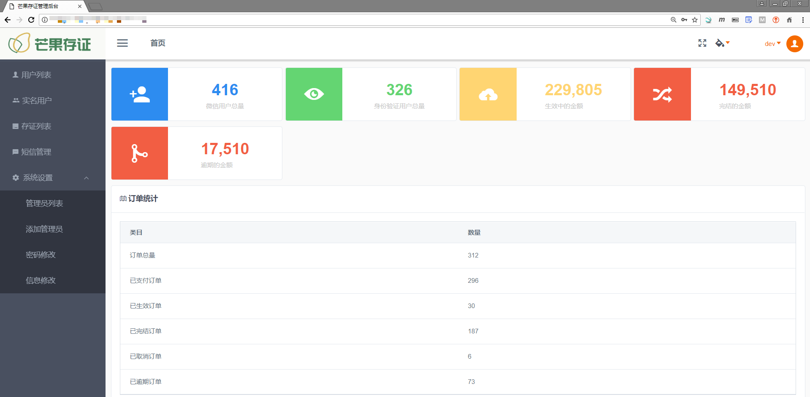

## 在线存证平台


### 项目时间

- 2018/3 - 2018/5

### 项目简介

- 第三方电子证据综合服务平台，通过在线签署借款电子合同，保证签署双方的身份主体信息真实有效。借款人和投资人通过平台签署借款协议，使得借款流程有理有据，保证了双方的合法权益，减少双方的不必要纠纷。
- 实现小程序客户端、Web后台管理的在线借据存证平台

### 技术实现

- Java Web 框架：SpringBoot
- 数据库：MySQL 5.6 + Redis
- 服务器：Centos 7.3
- 移动端实现：微信小程序
- 系统后台管理：vue.js + bootstrap
- 文档技术：接口文档使用 apidoc，项目说明使用 kancloud 在线文档
- 代码托管：码云

### 我的工作

- 需求分析，前后台技术选型
- 数据库设计、定时备份、Redis缓存
- Java 后台 RESTful API 接口开发（实现 JWT 接口验证）
- HTTPS 证书配置、Nginx 代理
- Linux 正式、测试服务器搭建
- 对接第三方接口平台（包括：微信支付、银行卡四要素验证、短信服务）
- 后台实现定时任务、短信消息队列
- 业务逻辑、流程图

### 项目难点

- 暂时还没想好


### 项目优化

- 待完善


### 项目展示

接口文档（使用 `apidoc` 工具编写）

- [RESTful API在线文档](https://api.chengchijinfu.com/mango/apidoc/index.html)


小程序移动端入口（二维码）

<div align="left"></div>


移动端截图

<div align="left"></div>


系统后台截图

<div align="left"></div>

<div align="left"></div>

<div align="left"></div>

<div align="left"></div>


### 代码统计

```powershell
PS D:\dev> .\cloc-1.76.exe .\mango_server\
github.com/AlDanial/cloc v 1.76  T=1.00 s (297.0 files/s, 31021.0 lines/s)
-------------------------------------------------------------------------------
Language                     files          blank        comment           code
-------------------------------------------------------------------------------
JavaScript                      66            370            790           6539
Java                            90           1620           2633           6331
XML                            120              0              0           5078
JSON                             5              3              0           4787
SQL                              1             20             57            787
HTML                             2             63              0            607
CSS                              4             98             37            492
Bourne Shell                     1             29             51            145
DOS Batch                        2             32              0            114
Maven                            1             36             53            110
Markdown                         3             16              0             64
YAML                             2              8              0             51
-------------------------------------------------------------------------------
SUM:                           297           2295           3621          25105
-------------------------------------------------------------------------------
```


